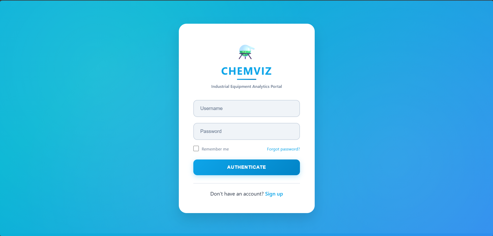
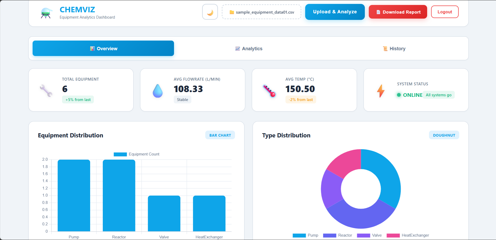
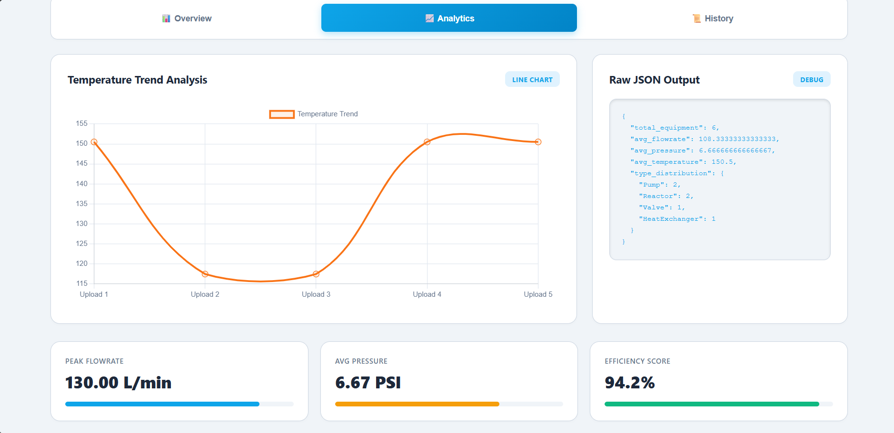
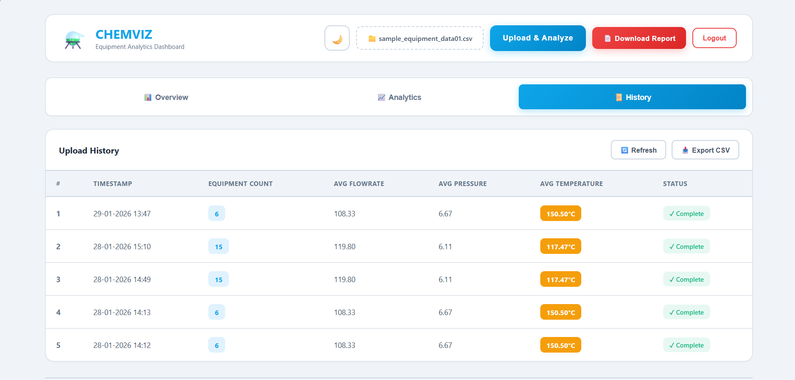
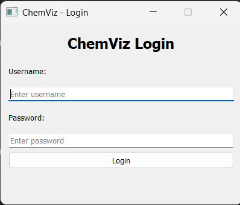
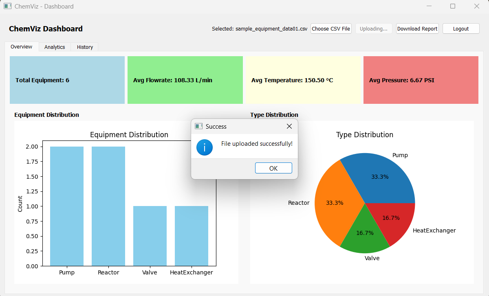
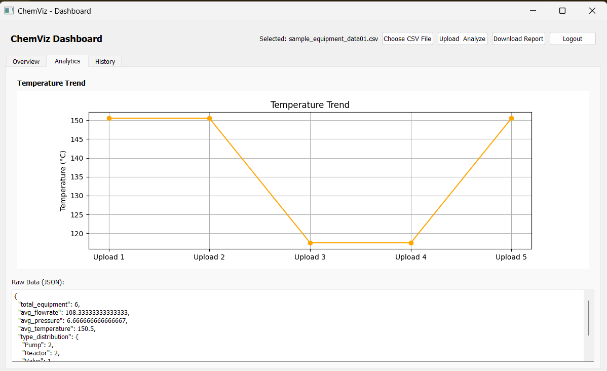
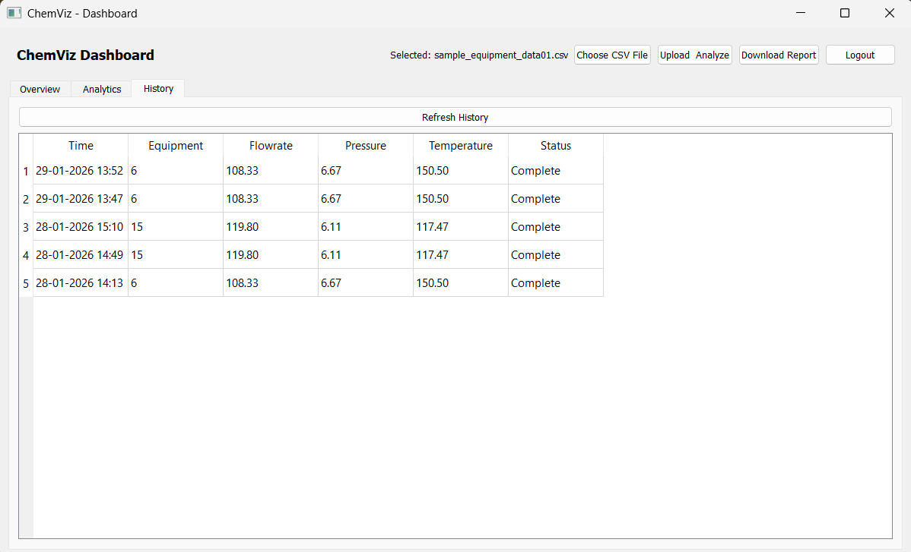

# ChemViz - Chemical Equipment Parameter Visualizer

A hybrid web and desktop application for visualizing and analyzing chemical equipment parameters with real-time data processing and comprehensive reporting capabilities.


## 📋 Table of Contents
- [Project Overview](#project-overview)
- [Features](#features)
- [Tech Stack](#tech-stack)
- [Project Structure](#project-structure)
- [Installation](#installation)
- [Usage](#usage)
- [API Documentation](#api-documentation)
- [Screenshots](#screenshots)
- [Troubleshooting](#troubleshooting)
- [Contributing](#contributing)
- [License](#license)

## 🎯 Project Overview

ChemViz is a full-stack application designed for chemical equipment monitoring and analysis. Users can upload CSV files containing equipment data (Equipment Name, Type, Flowrate, Pressure, Temperature) and receive comprehensive analysis through:

- **Web Application** - React-based responsive dashboard with interactive charts
- **Desktop Application** - PyQt5 native application with Matplotlib visualizations
- **Backend API** - Django REST Framework providing unified data processing

## ✨ Features

### Core Features
- ✅ **CSV Upload & Analysis** - Upload equipment data files for instant analysis
- ✅ **Real-time Statistics** - Calculate averages, totals, and distributions
- ✅ **Interactive Visualizations** - Bar charts, line charts, pie charts, and doughnut charts
- ✅ **History Management** - Automatic storage of last 5 uploads with timestamps
- ✅ **PDF Report Generation** - Comprehensive analysis reports with professional formatting
- ✅ **User Authentication** - Secure token-based authentication system
- ✅ **Multi-platform Support** - Works on web browsers and desktop (Windows/Mac/Linux)

### Web Application Features
- Responsive design for all screen sizes
- Dark/Light mode toggle
- Real-time chart updates
- Smooth animations and transitions
- File preview before upload

### Desktop Application Features
- Native OS integration
- Offline data viewing
- Fast performance
- Professional UI with modern styling
- Cross-platform compatibility

## 🛠️ Tech Stack

| Component | Technology | Version | Purpose |
|-----------|-----------|---------|---------|
| **Backend** | Django | 5.2.7 | RESTful API server |
| | Django REST Framework | 3.16.1 | API endpoints |
| | Pandas | 2.3.4 | Data processing |
| | Python-docx | 1.1.2 | Document generation |
| | ReportLab | 4.4.9 | PDF generation |
| **Web Frontend** | React | 18+ | UI framework |
| | Chart.js | Latest | Data visualization |
| | Axios | Latest | HTTP client |
| **Desktop Frontend** | PyQt5 | 5.15.11 | GUI framework |
| | Matplotlib | 3.10.8 | Charts & graphs |
| | Requests | 2.32.5 | API communication |
| **Database** | SQLite | Built-in | Data storage |
| **Version Control** | Git | - | Source control |

## 📁 Project Structure

```
CHEMICAL_PROJECT/
│
├── backend/                           # Django Backend
│   ├── backend/                       # Main Django project
│   │   ├── __init__.py
│   │   ├── asgi.py
│   │   ├── settings.py               # Django settings
│   │   ├── urls.py                   # Main URL routing
│   │   └── wsgi.py
│   │
│   ├── equipment/                     # Equipment app
│   │   ├── migrations/               # Database migrations
│   │   ├── __init__.py
│   │   ├── admin.py                  # Admin configuration
│   │   ├── apps.py
│   │   ├── models.py                 # Database models
│   │   ├── tests.py
│   │   ├── urls.py                   # App URL routing
│   │   └── views.py                  # API endpoints
│   │
│   ├── db.sqlite3                    # SQLite database
│   ├── manage.py                     # Django management script
│   └── requirements.txt              # Python dependencies
│
├── chemical_web/                      # React Web Application
│   ├── node_modules/                 # Node dependencies
│   ├── public/                       # Public assets
│   │   └── index.html
│   ├── src/                          # Source code
│   │   ├── App.js                    # Main React component
│   │   ├── App.css                   # Styling
│   │   ├── index.js                  # Entry point
│   │   └── logo.svg
│   ├── .gitignore
│   ├── package.json                  # NPM dependencies
│   ├── package-lock.json
│   └── README.md
│
├── desktop_app/                       # PyQt5 Desktop Application
│   ├── desktop_app.py                # Main desktop application
│   └── requirements.txt              # Desktop dependencies
│
├── frontend/                          # Additional frontend files
│   ├── index.html
│   └── chart.js
│
├── sample_equipment_data.csv          # Sample CSV file 1
├── sample_equipment_data01.csv        # Sample CSV file 2
├── requirements.txt                   # Project-wide requirements
└── README.md                          # This file
```

## 🚀 Installation

### Prerequisites

Before starting, ensure you have the following installed:
- **Python 3.8 or higher** - [Download Python](https://www.python.org/downloads/)
- **Node.js 14 or higher** - [Download Node.js](https://nodejs.org/)
- **npm or yarn** - Comes with Node.js
- **Git** - [Download Git](https://git-scm.com/)

### Step 1: Clone the Repository

```bash
git clone https://github.com/Niharika541-code/chemical-equipment-visualizer
cd CHEMICAL_PROJECT
```

### Step 2: Backend Setup (Django)

```bash
# Navigate to backend directory
cd backend

# Create virtual environment (recommended)
python -m venv venv

# Activate virtual environment
# On Windows:
venv\Scripts\activate
# On Mac/Linux:
source venv/bin/activate

# Install dependencies
pip install -r requirements.txt

# Apply database migrations
python manage.py makemigrations
python manage.py migrate

# Create superuser (optional, for admin panel)
python manage.py createsuperuser

# Run development server
python manage.py runserver
```

**Backend will be available at:** `http://127.0.0.1:8000`

### Step 3: Web Frontend Setup (React)

```bash
# Open a new terminal
# Navigate to web frontend directory
cd chemical_web

# Install dependencies
npm install

# Start development server
npm start
```

**Web application will open at:** `http://localhost:3000`

### Step 4: Desktop Application Setup (PyQt5)

```bash
# Open a new terminal
# Navigate to desktop app directory
cd desktop_app

# Install dependencies (use the same virtual environment as backend)
pip install -r requirements.txt

# Run desktop application
python desktop_app.py
```

**Note:** Ensure the Django backend is running before starting the desktop app!

## 📖 Usage

### Creating a User Account

#### Option 1: Via Django Admin
1. Run backend: `python manage.py runserver`
2. Go to `http://127.0.0.1:8000/admin`
3. Login with superuser credentials
4. Create new user

#### Option 2: Via API
```bash
curl -X POST http://127.0.0.1:8000/api/create-user/ \
  -H "Content-Type: application/json" \
  -d '{"username": "testuser", "password": "testpass123"}'
```

### Using the Web Application

1. **Open browser** and navigate to `http://localhost:3000`
2. **Login** with your credentials
3. **Choose a CSV file** using the file selector
4. **Click "Upload & Analyze"** to process the data
5. **Navigate between tabs:**
   - **Overview** - View statistics and distribution charts
   - **Analytics** - See temperature trends and detailed metrics
   - **History** - Review past uploads
6. **Download PDF Report** for comprehensive analysis

### Using the Desktop Application

1. **Run the desktop app**: `python desktop_app.py`
2. **Login** with your credentials
3. **Click "Choose CSV File"** to select a file
4. **Click "Upload & Analyze"** to process
5. **Navigate between tabs** to view different analyses
6. **Click "Download Report"** to save PDF report locally

### CSV File Format

Your CSV file must include these columns:

```csv
Equipment Name,Type,Flowrate,Pressure,Temperature
Pump-1,Pump,120,5.2,110
Compressor-1,Compressor,95,8.4,95
Valve-1,Valve,60,4.1,105
HeatExchanger-1,HeatExchanger,150,6.2,130
```

**Column Descriptions:**
- `Equipment Name` - Unique identifier for each equipment
- `Type` - Equipment category (Pump, Valve, Reactor, etc.)
- `Flowrate` - Flow rate in liters per minute (L/min)
- `Pressure` - Pressure in PSI
- `Temperature` - Temperature in degrees Celsius (°C)

**Sample files included:**
- `sample_equipment_data.csv` - 15 equipment entries
- `sample_equipment_data01.csv` - 6 equipment entries

## 🔌 API Documentation

### Base URL
```
http://127.0.0.1:8000/api
```

### Authentication Endpoints

#### Login
```http
POST /api/login/
Content-Type: application/json

{
  "username": "your_username",
  "password": "your_password"
}

Response:
{
  "token": "your_auth_token_here"
}
```

#### Create User
```http
POST /api/create-user/
Content-Type: application/json

{
  "username": "new_username",
  "password": "new_password"
}

Response:
{
  "message": "User created successfully"
}
```

### Data Endpoints

#### Upload CSV
```http
POST /api/upload/
Authorization: Token your_token_here
Content-Type: multipart/form-data

Form Data:
  file: [CSV file]

Response:
{
  "summary": {
    "total_equipment": 15,
    "avg_flowrate": 119.80,
    "avg_pressure": 5.87,
    "avg_temperature": 117.47,
    "type_distribution": {
      "Pump": 4,
      "Compressor": 2,
      "Valve": 3,
      "HeatExchanger": 2,
      "Reactor": 2,
      "Condenser": 2
    }
  }
}
```

#### Get Upload History
```http
GET /api/history/
Authorization: Token your_token_here

Response:
[
  {
    "time": "28-01-2026 20:30",
    "total_equipment": 15,
    "avg_flowrate": 119.80,
    "avg_pressure": 5.87,
    "avg_temperature": 117.47
  },
  ...
]
```

#### Generate PDF Report
```http
POST /api/generate-pdf-report/
Authorization: Token your_token_here
Content-Type: application/json

{
  "results": { /* summary data */ },
  "history": [ /* history array */ ],
  "username": "your_username"
}

Response:
[PDF file download]
```

### Example API Usage with cURL

```bash
# Login
TOKEN=$(curl -s -X POST http://127.0.0.1:8000/api/login/ \
  -H "Content-Type: application/json" \
  -d '{"username":"admin","password":"password"}' | jq -r '.token')

# Upload CSV
curl -X POST http://127.0.0.1:8000/api/upload/ \
  -H "Authorization: Token $TOKEN" \
  -F "file=@sample_equipment_data.csv"

# Get History
curl -X GET http://127.0.0.1:8000/api/history/ \
  -H "Authorization: Token $TOKEN"
```

## 📸 Screenshots

### Web Application

**Login Screen**



**Overview Dashboard**



**Analytics View**



**History Table**



### Desktop Application

**Login Window**



**Overview Tab**



**Analytics Tab**



**History Tab**




## 🐛 Troubleshooting

### Backend Issues

**Problem:** `Port 8000 is already in use`
```bash
# Find and kill the process
# Windows:
netstat -ano | findstr :8000
taskkill /PID <process_id> /F

# Mac/Linux:
lsof -ti:8000 | xargs kill -9
```

**Problem:** `ModuleNotFoundError: No module named 'rest_framework'`
```bash
pip install djangorestframework
```

**Problem:** `CORS errors in browser console`
```bash
pip install django-cors-headers
# Add 'corsheaders' to INSTALLED_APPS in settings.py
# Add 'corsheaders.middleware.CorsMiddleware' to MIDDLEWARE
```

### Web Frontend Issues

**Problem:** `Module not found` errors
```bash
# Delete node_modules and reinstall
rm -rf node_modules package-lock.json
npm install
```

**Problem:** `Cannot connect to backend`
- Ensure Django server is running on port 8000
- Check CORS settings in Django
- Verify API URL in App.js (should be `http://127.0.0.1:8000`)

**Problem:** Charts not displaying
```bash
npm install chart.js react-chartjs-2
```

### Desktop Application Issues

**Problem:** `No module named 'PyQt5'`
```bash
pip install PyQt5==5.15.11
```

**Problem:** `Connection failed` error
- Start Django backend first: `python manage.py runserver`
- Check BACKEND_URL in desktop_app.py (should be `http://127.0.0.1:8000`)

**Problem:** `ImportError: DLL load failed` (Windows)
```bash
pip uninstall PyQt5
pip install PyQt5==5.15.11
```

**Problem:** Matplotlib not displaying charts
```bash
pip install matplotlib==3.10.8
```

### General Issues

**Problem:** Database errors
```bash
# Reset database
cd backend
rm db.sqlite3
rm -rf equipment/migrations/*
# Keep __init__.py file in migrations folder
python manage.py makemigrations equipment
python manage.py migrate
```

**Problem:** Permission denied errors
```bash
# Run with administrator/sudo privileges
# Windows: Run Command Prompt as Administrator
# Mac/Linux: Use sudo command
```

## 🤝 Contributing

Contributions are welcome! Please follow these steps:

1. **Fork the repository**
2. **Create a feature branch**
   ```bash
   git checkout -b feature/your-feature-name
   ```
3. **Commit your changes**
   ```bash
   git commit -m "Add: your feature description"
   ```
4. **Push to the branch**
   ```bash
   git push origin feature/your-feature-name
   ```
5. **Open a Pull Request**

### Coding Standards
- Follow PEP 8 for Python code
- Use ESLint for JavaScript/React code
- Write clear, descriptive commit messages
- Add comments for complex logic
- Update documentation for new features

## 📄 License

This project was created as part of an **Intern Screening Task** for educational and evaluation purposes.

## 👨‍💻 Author

**Niharika Gautam**
- GitHub: [@Niharika541-code](https://github.com/Niharika541-code)
- Email: niharika36gautam@gmail.com

## 🙏 Acknowledgments

- Task provided by: [FOSSEE]
- Built with: Django, React, PyQt5
- Inspired by: Industrial equipment monitoring systems

## 📞 Support

For questions, issues, or suggestions:

1. **Check Documentation** - Review this README and inline code comments
2. **Search Issues** - Check if your issue already exists on GitHub
3. **Create New Issue** - Submit detailed bug reports or feature requests
4. **Contact** - Reach out via email for urgent matters

## 🎯 Future Enhancements

Potential features for future versions:

- [ ] Real-time WebSocket updates
- [ ] Export to Excel/CSV functionality
- [ ] Advanced filtering and search
- [ ] Multi-user collaboration features
- [ ] Cloud deployment (AWS/Heroku)
- [ ] Mobile application (React Native)
- [ ] Email notifications for critical values
- [ ] Custom alert thresholds
- [ ] Equipment maintenance scheduling
- [ ] Historical data comparison
- [ ] Advanced analytics and ML predictions
- [ ] Multi-language support

## 📊 Project Statistics

- **Lines of Code:** ~3000+
- **API Endpoints:** 5
- **Frontend Components:** 2 (Web + Desktop)
- **Supported File Format:** CSV
- **Database Tables:** 2
- **Chart Types:** 4 (Bar, Line, Pie, Doughnut)

---

**Version:** 2.0.5  
**Last Updated:** January 29, 2026  
**Status:** ✅ Production Ready

**Made with ❤️ for Chemical Equipment Analysis**